# Projet Machine Learning - Classification de tumeurs mammaires

## 1. Probleme

### Contexte

Le cancer du sein est un cas d'usage classique de classification binaire : a partir de mesures numeriques calculees sur des noyaux cellulaires, l'objectif est de distinguer les tumeurs benignes des tumeurs malignes. Le projet utilise le jeu de donnees Breast Cancer Wisconsin Diagnostic, expose dans `scikit-learn` et provenant du UCI Machine Learning Repository.

### Objectif metier

L'objectif metier est de fournir une aide a la decision pour prioriser les cas potentiellement malins. Dans ce contexte, le rappel de la classe `malignant` est critique : un faux negatif correspondrait a une tumeur maligne classee comme benigne. La precision et la specificite restent importantes pour limiter les alertes inutiles, mais le choix du meilleur modele privilegie le rappel des cas malins, puis l'AUC ROC et le F1-score.

## 2. Donnees

### Source

- `sklearn.datasets.load_breast_cancer`
- Documentation scikit-learn : https://scikit-learn.org/stable/modules/generated/sklearn.datasets.load_breast_cancer.html
- Source originale : UCI Machine Learning Repository, Breast Cancer Wisconsin Diagnostic : https://archive.ics.uci.edu/dataset/17/breast+cancer+wisconsin+diagnostic

### Description

Le jeu de donnees contient 569 observations et 30 variables explicatives numeriques. La cible a ete recodee en `target_malignant`, avec `1 = malignant` et `0 = benign` pour aligner les metriques de classification sur le risque metier.

Repartition des classes :

| diagnosis | count | percentage |
| --- | --- | --- |
| benign | 357 | 0.6274165202108963 |
| malignant | 212 | 0.37258347978910367 |

### Limitations

- L'echantillon est limite : 569 observations ne suffisent pas a valider un usage clinique reel.
- Les donnees sont propres et deja structurees, donc le projet ne couvre pas les problemes frequents de donnees hospitalieres brutes.
- Les observations proviennent d'un contexte precis ; une generalisation robuste demanderait une validation externe.
- Les variables sont derivees d'images, mais les images originales ne sont pas disponibles ici.

## 3. Analyse exploratoire des donnees

### Points cles

- Aucune valeur manquante n'a ete detectee dans les variables numeriques (`0` valeurs manquantes).
- Les classes sont moderement desequilibrees : davantage de cas benins que malins.
- Les variables les plus correlees a la malignite sont : worst concave points (0.794), worst perimeter (0.783), mean concave points (0.777), worst radius (0.776), mean perimeter (0.743), worst area (0.734), mean radius (0.730), mean area (0.709).
- Plusieurs variables de taille, concavite et texture separent visuellement les deux classes.

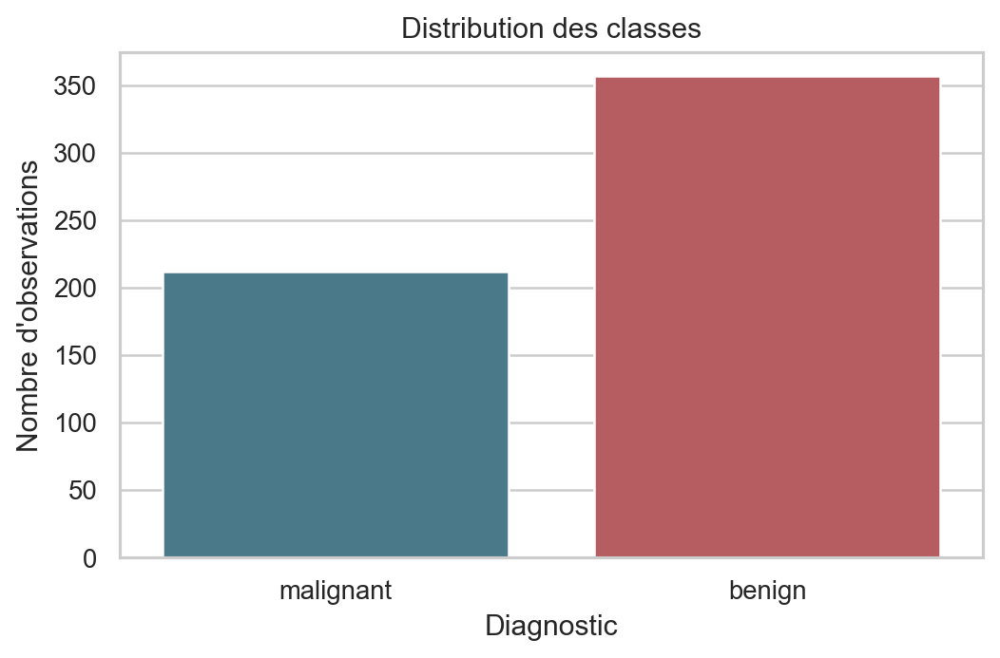

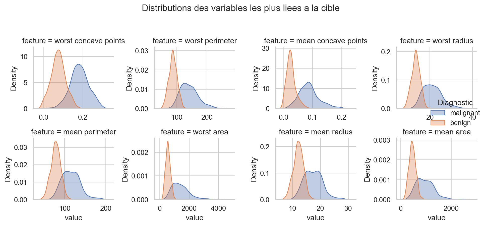

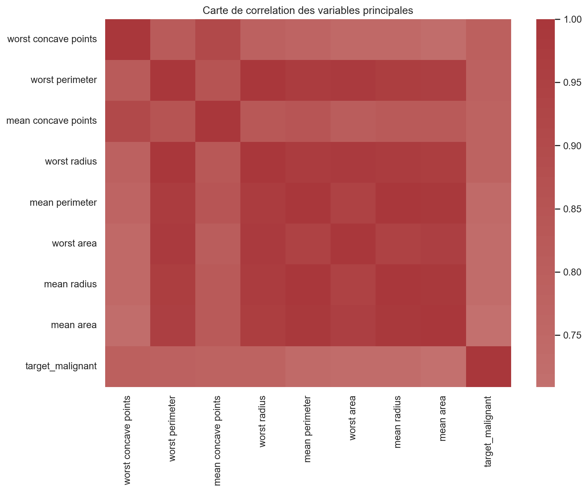

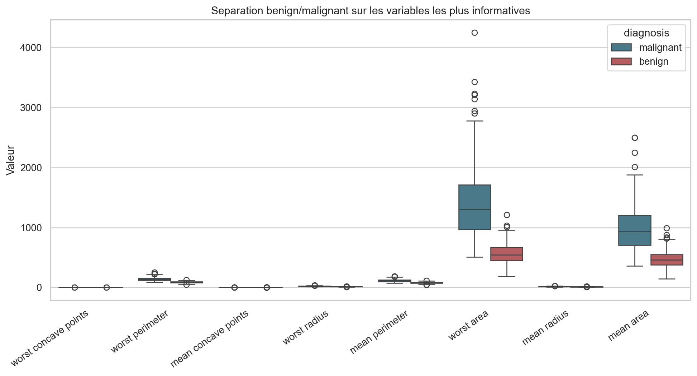

## 4. Preparation

### Nettoyage

- Verification des valeurs manquantes.
- Separation stricte train/test stratifiee : 455 lignes en entrainement et 114 lignes en test.
- Imputation mediane integree dans les pipelines, meme si aucune valeur manquante n'est observee, afin de rendre le pipeline robuste.
- Standardisation appliquee uniquement aux modeles sensibles aux echelles, dans un `Pipeline`, donc ajustee uniquement sur les folds d'entrainement pendant la validation croisee.

### Ingenierie des fonctionnalites

- Reencodage de la cible pour faire de `malignant` la classe positive.
- PCA non supervisee pour regarder la structure des donnees, et PCA integree dans un modele `PCA + regression logistique`.
- La reduction de dimension est placee apres le split et dans le pipeline lorsque le modele l'utilise, afin d'eviter les fuites de donnees.

## 5. Modelisation

### Plusieurs modeles

Les modeles compares sont :

- Regression logistique : baseline lineaire interpretable.
- K plus proches voisins : baseline non parametrique sensible aux distances.
- SVM RBF : modele non lineaire performant sur petits jeux de donnees tabulaires.
- Random Forest : methode d'ensemble obligatoire, robuste aux relations non lineaires.
- Gradient Boosting : seconde methode d'ensemble, souvent competitive sur donnees tabulaires.
- PCA + regression logistique : integration d'une reduction de dimension non supervisee dans un pipeline supervise.
- Random Forest optimise : recherche d'hyperparametres par validation croisee sur l'ensemble d'entrainement.

### Justification

Cette combinaison couvre des familles complementaires : lineaire, distance, marge, arbres en bagging, boosting et reduction de dimension. Les pipelines limitent les fuites de donnees car chaque transformation est ajustee dans la validation croisee ou sur l'entrainement uniquement.

## 6. Evaluation

### Metriques adaptees

- `recall_malignant` : prioritaire pour limiter les faux negatifs.
- `precision_malignant` : part des alertes malignes qui sont correctes.
- `specificity_benign` : capacite a reconnaitre les cas benins.
- `f1_malignant` : compromis precision/rappel.
- `roc_auc` : qualite globale de classement des scores.
- `accuracy` : information secondaire, car elle peut masquer les erreurs sur la classe critique.

### Validation croisee sur l'entrainement

| model | cv_accuracy_mean | cv_recall_malignant_mean | cv_f1_malignant_mean | cv_roc_auc_mean |
| --- | --- | --- | --- | --- |
| Regression logistique | 0.971 | 0.959 | 0.962 | 0.995 |
| SVM RBF | 0.969 | 0.953 | 0.958 | 0.995 |
| PCA + regression logistique | 0.967 | 0.953 | 0.956 | 0.994 |
| Random Forest optimise | 0.958 | 0.953 | 0.945 | 0.988 |
| Gradient Boosting | 0.967 | 0.947 | 0.955 | 0.991 |
| Random Forest | 0.963 | 0.941 | 0.949 | 0.989 |
| K plus proches voisins | 0.969 | 0.929 | 0.957 | 0.986 |

### Comparaison sur l'ensemble de test

| model | accuracy | precision_malignant | recall_malignant | specificity_benign | f1_malignant | roc_auc |
| --- | --- | --- | --- | --- | --- | --- |
| PCA + regression logistique | 0.974 | 0.953 | 0.976 | 0.972 | 0.965 | 0.997 |
| SVM RBF | 0.982 | 0.976 | 0.976 | 0.986 | 0.976 | 0.995 |
| Regression logistique | 0.974 | 0.976 | 0.952 | 0.986 | 0.964 | 0.995 |
| Random Forest | 0.974 | 1.000 | 0.929 | 1.000 | 0.963 | 0.997 |
| Random Forest optimise | 0.974 | 1.000 | 0.929 | 1.000 | 0.963 | 0.997 |
| Gradient Boosting | 0.965 | 1.000 | 0.905 | 1.000 | 0.950 | 0.995 |
| K plus proches voisins | 0.956 | 0.974 | 0.905 | 0.986 | 0.938 | 0.982 |

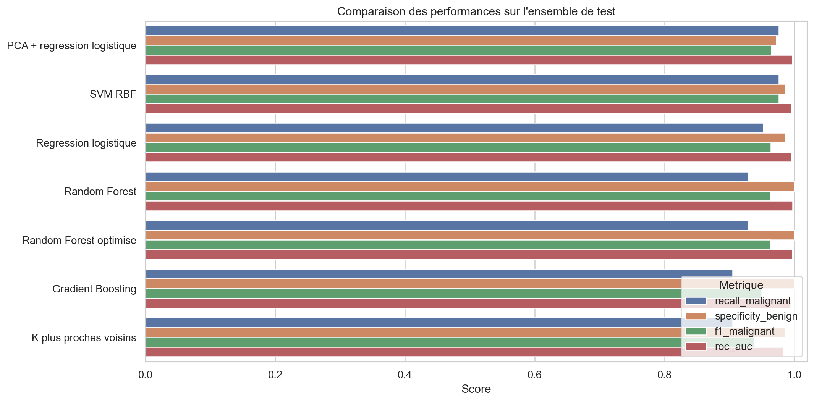

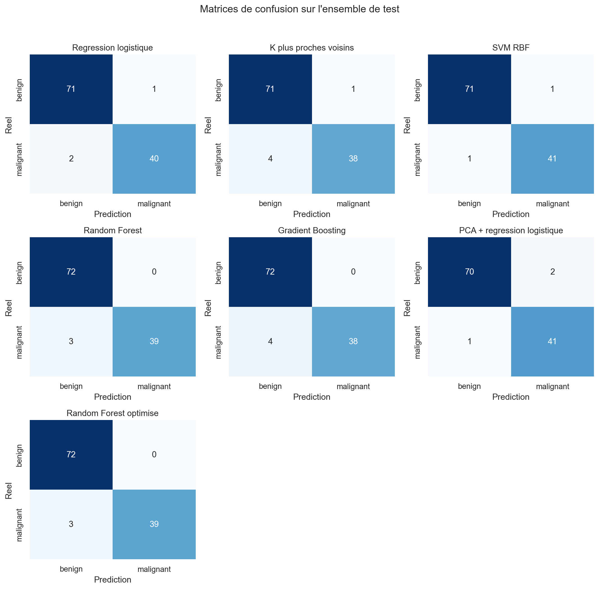

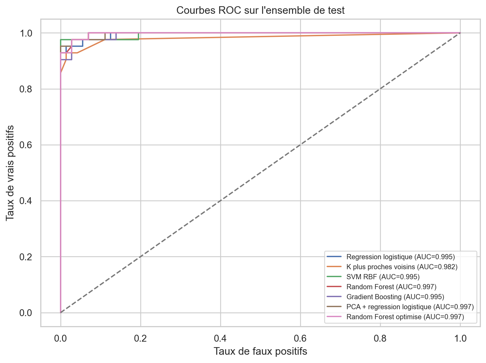

## 7. Analyse

### Interpretation des resultats

Le meilleur modele selon la regle metier est **PCA + regression logistique**. Sur l'ensemble de test, il obtient :

- Accuracy : 0.974
- Precision malignant : 0.953
- Recall malignant : 0.976
- Specificite benign : 0.972
- F1 malignant : 0.965
- ROC AUC : 0.997

Le rappel eleve indique que le modele limite fortement le risque de manquer des cas malins sur le test. L'AUC ROC permet aussi de verifier que le modele classe globalement bien les observations, au-dela d'un seuil fixe.

La Random Forest optimisee a ete reglee avec :

```json
{
  "model__max_depth": null,
  "model__min_samples_leaf": 4,
  "model__n_estimators": 200
}
```

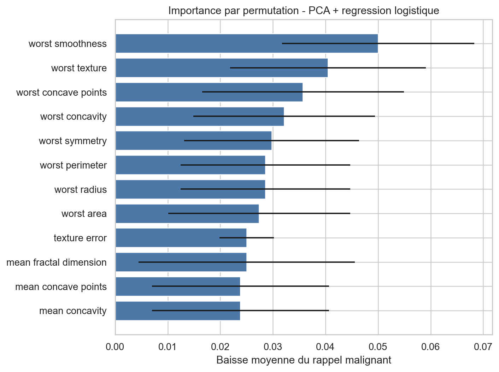

### Methode non supervisee

La PCA et KMeans ont ete ajustes uniquement sur l'ensemble d'entrainement.

- Variance expliquee par les 2 premieres composantes PCA : 0.631
- Nombre de composantes necessaires pour 95% de variance expliquee : 10
- ARI KMeans sur train : 0.662
- ARI KMeans sur test : 0.617
- Silhouette KMeans sur train : 0.343

KMeans retrouve partiellement la structure benign/malignant sans utiliser les labels, ce qui confirme qu'une partie du signal est visible dans l'espace des variables. Le score ARI reste imparfait, donc le clustering ne remplace pas la classification supervisee.

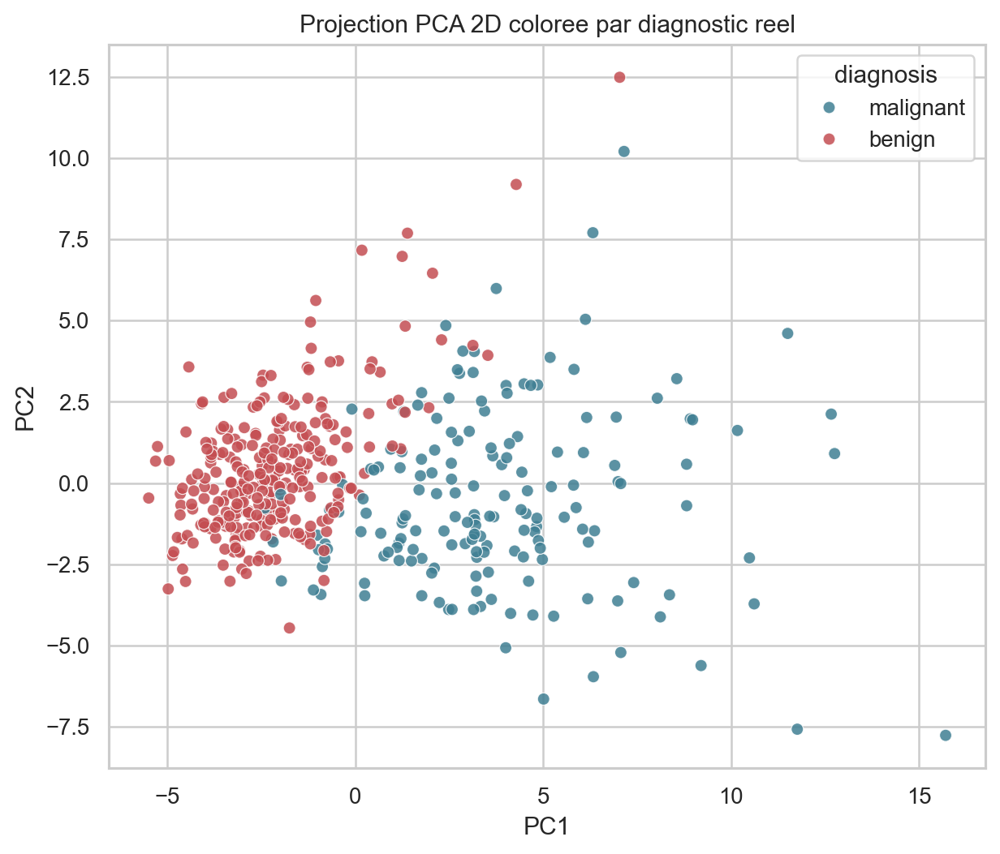

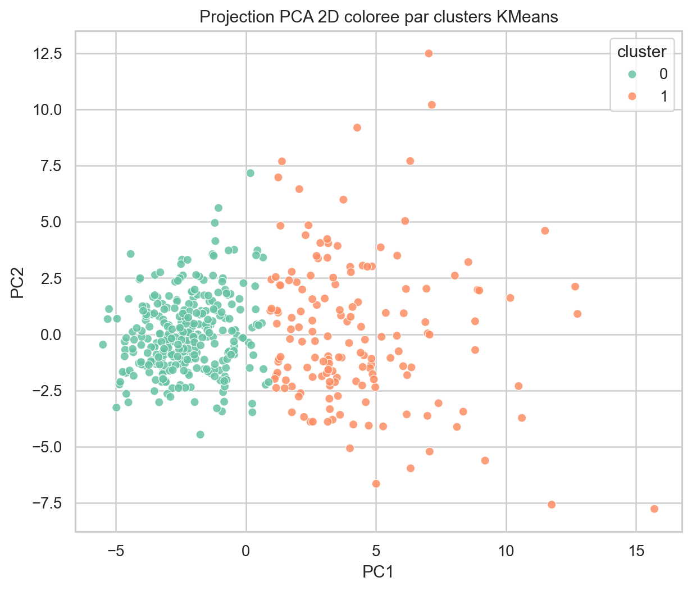

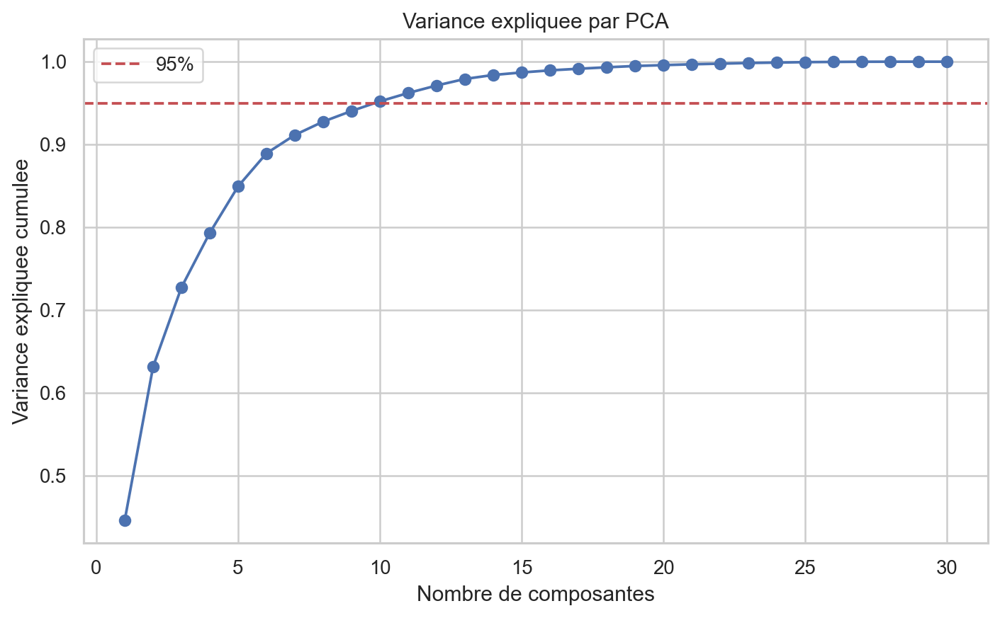

## 8. Conclusion

### Recommandations

- Utiliser **PCA + regression logistique** comme modele candidat, car il maximise le rappel de la classe maligne tout en conservant de bonnes performances globales.
- En contexte medical, ajuster le seuil de decision avec les experts metier pour controler explicitement le compromis faux negatifs / faux positifs.
- Completer cette analyse par une validation externe sur un autre centre ou une periode differente avant toute utilisation operationnelle.
- Conserver les pipelines `scikit-learn` pour garantir la reproductibilite et limiter les fuites de donnees.

### Limitations et travaux futurs

- Le test set est petit : les scores peuvent varier selon l'echantillonnage.
- Le dataset est pedagogique et deja nettoye ; un cas reel demanderait une gestion plus poussee de qualite, biais, valeurs aberrantes et derive temporelle.
- Les recommandations ne constituent pas un avis medical.
- Travaux futurs : calibration des probabilites, optimisation du seuil, validation externe, comparaison avec XGBoost/LightGBM si autorise, et analyse d'explicabilite plus complete.
